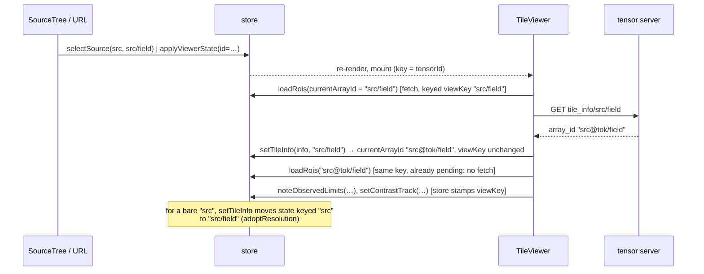

# Image viewer — architecture

How the dataviewer route (`/viewer`, `HomePage`) is put together: which
component owns what, what lives in the store and for how long, and the
channels through which the parts depend on each other. For the ROI subsystem's
own design see [roi-annotations-ui.md](roi-annotations-ui.md); for the
refactor this audit motivates, [viewer-refactor-proposal.md](viewer-refactor-proposal.md).

## Files

| File | Lines | Role |
|------|------:|------|
| `store.ts` | 1870 | One zustand store: connection, catalog, recents, jobs, *and* all viewer state, ROI actions, selectors |
| `components/TileViewer.tsx` | 1200 | 2-D viewer: pixel sources, plane gate, contrast sampling, hover, ROI overlay + authoring, label overlay, camera mirror, wheel navigation |
| `components/SliceControls.tsx` | 780 | Axis sliders, play driver, 2-D/3-D toggle, contrast/gamma/colour |
| `components/VolumeViewer.tsx` | 460 | 3-D viewer (one server-scaled volume, `XR3DLayer`) |
| `components/RoiPanel.tsx`, `RoiToolStrip.tsx`, `LabelPanel.tsx` | 660 | Annotation and label-overlay controls |
| `components/ViewerPane.tsx` | 190 | Picks 2-D/3-D viewer, error boundary, remount key |
| `hooks/useContrastWindow.ts` | 100 | Contrast derivation shared by both viewers; also publishes to the store |
| `hooks/useLabelOverlay.ts` | 76 | Loads a label set's pixel sources |
| `hooks/useViewerUrlSync.ts` | 100 | URL ⇄ store |
| `utils/vivUtils.ts`, `roiLayers.ts`, `labelLayers.ts`, `viewerUrl.ts`, `roiDraft.ts`, `roiHitTest.ts`, `sliceUi.ts`, `volumeUtils.ts` | ~2000 | Pure helpers (well tested) |

The pure helpers are in good shape. The complexity is in `store.ts`,
`TileViewer.tsx` and `SliceControls.tsx`, and in how those three talk to each other.

## Component tree

```
HomePage                          useViewerUrlSync()  (URL ⇄ store)
├─ SourceTree                     selectSource(), setLabelOverlay()
├─ ViewerPane  tensorId = requestedArrayId ?? activeTensorId
│  └─ <key = tensorId#2d|3d#attempt>
│     ├─ TileViewer   arrayId = that same id        (lazy chunk)
│     │   ├─ VivStage (deck.gl / Viv; camera seeded once from store)
│     │   ├─ RoiToolStrip (draft passed as a prop)
│     │   └─ HoverReadout (ref-fed, never re-renders the stage)
│     └─ VolumeViewer arrayId = that same id        (lazy chunk)
│         └─ VolumeStage
└─ control column
   ├─ SliceControls tensorId = activeTensorId   ← note: a different id
   ├─ LabelPanel, RoiPanel, RoiAuthor           (2-D only)
   └─ MetaPanel <key = activeSourceId>
```

The viewer and the panel get **different ids for the same view**. The viewer
gets `requestedArrayId ?? activeTensorId`, which may be pinned. The panel gets
`activeTensorId`, which never is. And neither id is the one most selectors
compare against (`viewKey`, below).

## Store state, by lifetime

Every field belongs to exactly one of these lifetimes. How that lifetime is
enforced differs from field to field, and those differences are the main
source of bugs (see *Scoping mechanisms*).

| Lifetime | Fields | Enforced by |
|----------|--------|-------------|
| Session / connection | `client`, `connectionState`, `apiBase`, `devMode`, `sources`, `scanning`, `sourceJobs` | — |
| Persisted preference | `channelColors` (localStorage, **keyed by source_id**), `recentIds` | storage |
| Viewer preference (outlives a tensor) | `slice.contrastMode`, `percentileScale`, `gamma`, `volumeRenderMode`, `labelOpacity`, `showRois`, `tool`, `newLabel`, `newSetName`, `newPolylineWidth`, `showAdvancedOptions` | carried explicitly in `applyViewerState`, left alone in `selectSource` |
| Per source | `channelNames` (keyed by source_id), `MetaPanel` state | map key; component `key` |
| Selection | `activeSourceId`, `activeTensorId`, `requestedArrayId` | — |
| Per tensor, **reset** on change | `slice.t/z/c/axes`, `slice.fixedLimits`, `render3d`, `camera2d`, `camera3d`, `playAxis`, `planeReady`, `appliedLimits`, `planeLimits`, `tileInfo` | written out in `selectSource`; `applyViewerState` overwrites a *different* subset |
| Per tensor, **guarded** at read | `tileInfo`/`tileInfoFor`; `rois`, `roiSets`, `roiScopes`, `roisPending`, `roisError` (`roisFor`, `roisPendingFor`, `roisErrorFor`); `visibleSets`/`visibleSetsFor`; `draft`/`draftFor`; `broadcastAxes`/`broadcastAxesFor`; `observedLimits`/`observedLimitsFor`; `contrastTrack`/`contrastTrackFor` | `select*` compares the `…For` field to `viewKey` (`tileInfo`: to the requested id) |
| Per tensor, scoped by id content | `labelOverlay` (the set's id names its image) | `selectLabelOverlay` |
| Per plane | `draftSliceKey`, and in `TileViewer` local state: `loadedKey`, `samples.key`, `labelLoadedKey` | key comparison |
| Per mount (viewer-local) | pixel sources, samples, hover, draft cursor, tile error | `ViewerPane` remount key |
| Session latch | ROI `roisUnavailable` (501) | — |

`SliceState` mixes two lifetimes. The indices are per tensor and the display
settings are preferences. So every consumer that diffs on `slice` has to
re-derive a content key to avoid a refetch when contrast moves (`selectionKey`
in TileViewer, `requestKey` in VolumeViewer, `sliceKey` for drafts).

## Tensor identity

One view has up to six spellings, and different code compares different ones:

| Spelling | Example (versioned source, click on `src/field`) | Who uses it |
|----------|--------------------------------|-------------|
| `activeTensorId` | `src/field`, or bare `src` on a source click | SliceControls `sliderGrid`, MetaPanel, URL fallback |
| `requestedArrayId` | `null`, or a link's `src@pin/field` / `src` | ViewerPane prop (via `??`) |
| viewer `arrayId` prop, `= tileInfoFor` | `src/field` | tile_info fetch, `selectTileInfo` |
| `tileInfo.array_id` | `src@tok/field`: resolved field **plus the server's current version token**, always, for any versioned source (`_versioned_array_id`, #780) | URL write-back |
| `currentArrayId(s)` | `tileInfo.array_id` once `tileInfoFor` matches the request, else the request, so it **changes spelling mid-view** | address of ROI server calls; `loadRois`'s exact-match guard |
| `viewKey(s)` | `currentArrayId` without its token: `src/field` before and after the grid lands. Bare `src` until it resolves, then `src/field` | every `…For` field and its selector, label overlay, tree highlight |

Resolution happens **inside the viewer**. The store cannot say which tensor
is on screen until a React component has mounted, fetched `tile_info`, and
published it back through an effect:



## Scoping mechanisms

"This state belongs to the tensor/plane on screen" is enforced six different ways:

1. **Explicit reset** in `selectSource`, listed field by field.
2. **Explicit overwrite** in `applyViewerState`, which carries a different list.
   Today it runs only once, at hydration, so the difference is latent.
3. **Read guard**: a `…For` companion field plus a selector. The store's
   actions stamp every field with `viewKey` and every selector compares
   against it, except `selectTileInfo`, which pairs with the requested id.
   `adoptResolution` (in `setTileInfo`) moves fields keyed to a bare
   `source_id` onto the field it resolves to, because the key changes at that
   moment. The `SELECTOR_ONLY_FIELDS` lint rule forces reads through the
   selectors, but nothing checks that a new writer uses `viewKey`. Writers
   stamping whatever id they had on hand is the bug class of #1156/#1163.
4. **Id content**: `labelOverlay`.
5. **Remount**: `ViewerPane`'s key drops all viewer-local state. #1163 had to
   add `advanceViewerKey` because the key changes when the id changes
   spelling during resolution.
6. **Key comparison** for plane-scoped state: `loadedKey` vs `selectionKey`,
   `draftSliceKey` vs `sliceKey(slice)`, `labelLoadedKey` vs the label plane key.

## Viewer → store publish-back

The viewers render, and they are also the only producers of several facts
that panels and the URL read. Each channel is an effect, so the store is one
commit behind the viewer. Setters compare content so the effect doesn't loop.

| Published by | Field | Read by |
|--------------|-------|---------|
| Tile/VolumeViewer | `tileInfo` (+`For`) via `setTileInfo`, which also clamps `slice` | SliceControls (slider bounds, 3-D offer, dtype), RoiPanel, MetaPanel, URL sync, `viewKey` → every scoped selector |
| both, via `useContrastWindow` | `planeLimits`, `observedLimits` (+`For`), `contrastTrack` (+`For`), `appliedLimits` | SliceControls (fixed-window bar, Min/Max, seeding Fixed) |
| both | `planeReady` | play driver in SliceControls (polls `getState()`) |
| VivStage / VolumeStage | `camera2d` / `camera3d` (150 ms trailing) | URL sync; seeds the next mount |
| TileViewer | `loadRois`, `setDraft`, `createRoi`, `deleteRoi`, `setSelectedRoi` | RoiPanel, RoiToolStrip |
| TileViewer wheel handler | `slice` | everything |

The contrast track is a derived value: a function of dtype, observed levels,
plane limits and the fixed window. It is stored anyway, so that panel and
shader agree (#955). That makes it identity-scoped state, which is why its
setter takes the key from the store rather than from the viewer's `arrayId`
prop: the prop is the address asked for, not the tensor it resolved to.

## Inside TileViewer

Everything is chained through string keys, because deck.gl and Viv diff by
reference:

- `selectionKey` = `JSON(vivSelection(info, slice))`: the plane **asked for**.
- `loadedKey`: the `selectionKey` at the time `onViewportLoad` last fired
  with every tile present. This is the plane **on screen**.
- `dataValid = loadedKey === selectionKey` drives the "Reading plane…" cover
  (dropped during play).
- `shownPlane` (from `loadedKey`) drives the ROI overlay, hit-testing, the pin
  for new ROIs, and the Delete key. RoiPanel counts against `slice`, the
  plane asked for. The difference is deliberate.
- The label overlay derives `labelSelectionKey` (asked) and `labelShownKey`
  (on screen) through `labelSelection(info, overlay.info, …)`, and is drawn
  only once `labelLoadedKey` matches the on-screen key.
- `planeReady = dataValid && (no overlay || overlay errored || overlay showing)`
  is published for play.
- `samples` holds a raster of the coarsest level per selection. It is
  deliberately kept across a plane change so contrast doesn't flash, and
  `uniformValue` re-checks its `key`.

Refs stand in for dependencies throughout: `selectionKeyRef`, `labelRequestedRef`,
`draftRef`, `onUnsupportedRef`, `hoverSinkRef`, `draftCursorSinkRef`. That
keeps callback identities stable for deck.gl, and it also means the effect
dependency lists do not show the real data flow.

## Play

The driver lives in `SliceControls` (a panel). A timer steps the axis, sets
`planeReady=false` itself, then polls `planeReady` every 25 ms, giving up
after 5 s. The viewer computes readiness, the panel consumes it, and the only
connection between them is a store boolean. If `SliceControls` unmounts,
play stops.

## URL sync

`useViewerUrlSync` runs `applyViewerState` once, after the client exists,
then writes the URL back whenever state changes. It writes
`tileInfo.array_id ?? requestedArrayId ?? activeTensorId`, so an unpinned
view gets the server's version token put into its URL. `applyViewerState` is
a second entry path besides `selectSource`, and it doesn't share its reset
list. That is why scoping moved from resets to read guards.

## Invariants worth keeping

These are real, hard-won, and any refactor has to preserve them:

- Overlays follow the plane **on screen**, not the plane asked for; panels count against the plane asked for.
- `loadRois` is idempotent on landed and pending scopes (a 2-D→3-D→2-D flip remounts).
- deck.gl props keep reference stability: module-level extensions, JSON keys, ref-held callbacks.
- The camera is a trailing mirror, seeded once per mount and never fed back in.
- A draft is hidden (not destroyed) off its tensor, plane, 2-D mode, or with `showRois` off.
- Label overlay and image load independently; an overlay failure never costs the image.
