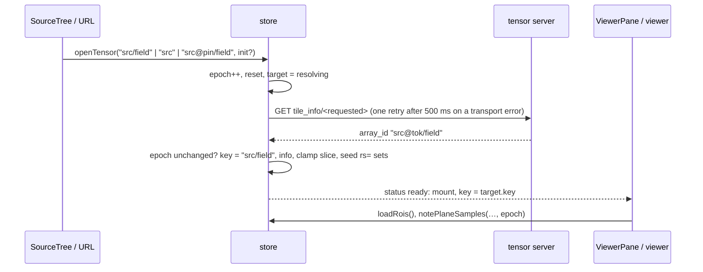

# Image viewer — architecture

How the dataviewer route (`/viewer`, `HomePage`) is put together: which
component owns what, what lives in the store and for how long, and the
channels through which the parts depend on each other. For the ROI subsystem's
own design see [roi-annotations-ui.md](roi-annotations-ui.md).

## Files

| File | Role |
|------|------|
| `store/index.ts` | Composes the slices below into `useAppStore`; re-exports every slice's actions, types and selectors, so `from "../store"` is the one import |
| `store/target.ts` | The view target, `openTensor`/`retryTarget`/`resolveTarget`, position, display, view mode, cameras |
| `store/tensorView.ts`, `views.ts`, `roi.ts` | The per-tensor record and its LRU; ROI and label-overlay actions; ROI selectors and the scope-landing reducer |
| `store/runtime.ts` | What only a mounted viewer observes, and the derived contrast selectors |
| `store/slice.ts` | `PositionState`/`DisplayState`, `moved`, `sliceKey` |
| `store/connection.ts`, `recents.ts`, `jobs.ts`, `preferences.ts` | Client and catalog poll; recents; resolve/warm jobs; preferences and channel colours |
| `components/TileViewer.tsx` | 2-D viewer: composes the hooks below and renders |
| `components/VivStage.tsx` | The deck.gl half: view state, layers, camera mirror |
| `components/SliceControls.tsx` | Axis sliders, 2-D/3-D toggle, contrast/gamma/colour |
| `components/VolumeViewer.tsx` | 3-D viewer (one server-scaled volume, `XR3DLayer`) |
| `components/RoiPanel.tsx`, `RoiToolStrip.tsx`, `LabelPanel.tsx` | Annotation and label-overlay controls |
| `components/ViewerPane.tsx` | Waits for the target, picks 2-D/3-D viewer, error boundary, remount key |
| `hooks/usePixelSources.ts` | Viv sources from the resolved grid, tile errors |
| `hooks/usePlaneGate.ts` | `selection`, `loadedSelection`, `dataValid`, `onViewportLoad` |
| `hooks/useContrastSamples.ts` | Overview raster → `notePlaneSamples`; uniform-plane value |
| `hooks/useRoiOverlay.ts`, `useRoiAuthoring.ts` | Stored annotations over the plane on screen; drawing, selecting, deleting |
| `hooks/useLabelOverlayLayers.ts`, `useLabelOverlay.ts` | Label overlay layers and gate; loads a set's pixel sources |
| `hooks/useHoverReadout.ts`, `useSliceWheelNavigation.ts` | Ref-fed hover badge; hold t/z/c and scroll |
| `hooks/useElementSize.ts`, `useCameraMirror.ts`, `useMountEpoch.ts` | Shared by both viewers |
| `hooks/usePlayback.ts` | Play, mounted once by the page |
| `hooks/useDebouncedCommit.ts` | One debounce per slider |
| `hooks/useViewerUrlSync.ts` | URL ⇄ store |
| `utils/vivUtils.ts`, `roiLayers.ts`, `labelLayers.ts`, `viewerUrl.ts`, `roiDraft.ts`, `roiHitTest.ts`, `sliceUi.ts`, `volumeUtils.ts` | Pure helpers (well tested) |

## Component tree

```
HomePage                          useViewerUrlSync()  (URL ⇄ store)
├─ SourceTree                     openTensor(), setLabelOverlay()
├─ ViewerPane                     renders nothing until target.status === "ready"
│  └─ <key = target.key#epoch#2d|3d#attempt>
│     ├─ TileViewer   info = target.info            (lazy chunk)
│     │   ├─ VivStage (deck.gl / Viv; camera seeded once from store)
│     │   ├─ RoiToolStrip (draft passed as a prop)
│     │   └─ HoverReadout (ref-fed, never re-renders the stage)
│     └─ VolumeViewer info = target.info            (lazy chunk)
│         └─ VolumeStage
└─ control column
   ├─ SliceControls tensorId = activeTensorId
   ├─ LabelPanel, RoiPanel, RoiAuthor           (2-D only)
   └─ MetaPanel <key = activeSourceId>
```

Both viewers are handed the resolved `tile_info` and never fetch it. The
panels read the same grid through `selectTileInfo`.

## Store state, by lifetime

Every field belongs to exactly one of these lifetimes; *Scoping mechanisms*
says how each is enforced.

| Lifetime | Fields | Enforced by |
|----------|--------|-------------|
| Session / connection | `client`, `connectionState`, `apiBase`, `devMode`, `sources`, `scanning`, `sourceJobs` | — |
| Persisted preference | `channelColors` (localStorage, **keyed by source_id**), `recentIds` | storage |
| Viewer preference (outlives a tensor) | `display.contrastMode`, `percentileScale`, `gamma`, `volumeRenderMode`, `labelOpacity`, `showRois`, `tool`, `newLabel`, `newSetName`, `newPolylineWidth`, `showAdvancedOptions` | left alone by `openTensor`; a link may override the first five |
| Per source | `channelNames` (keyed by source_id), `MetaPanel` state | map key; component `key` |
| Selection | `activeSourceId`, `activeTensorId` (the stable address that was asked for) | `openTensor` |
| Target | `target`: `epoch`, `requested`, `status`, `key`, `info` (the one `tile_info`), `error` | `openTensor`; landings are dropped when `epoch` moved on |
| Per tensor, **reset** on open | `position` (`t/z/c/axes`), `display.fixedLimits`, `render3d`, `camera2d`, `camera3d`, `playAxis`, `runtime`; and from a link, `visibleSets` and `labelOverlay` | the one reset list in `openTensor` |
| Per tensor, **one record each** | `views[key]`: `rois`, `roiSets`, `roiScopes`, `roisPending`, `roisError`, `visibleSets`, `broadcastAxes`, `draft` (with its slice key), `observedLimits`; a small LRU | the selectors read `views[target.key]`; writers capture the key and write into that record |
| Runtime (what only a viewer can observe) | `runtime`: `planeReady`, `samples` (the last plane's sorted grey levels) | writes carry the `target.epoch` they were observed under; another epoch is dropped. A position change un-readies the plane in the same write |
| Per tensor, scoped by id content | `labelOverlay` (the set's id names its image) | `selectLabelOverlay` |
| Per plane | `views[key].draft.sliceKey`, and in `usePlaneGate` and the label hooks: `loadedSelection`, `loadedKey` | key comparison; the selection by object identity |
| Per mount (viewer-local) | pixel sources, samples, hover, draft cursor, tile error | `ViewerPane` remount key |
| Session latch | ROI `roisUnavailable` (501) | — |

`position` and `display` are separate objects because they change for different
reasons: a move asks the server for other pixels, a contrast drag re-shades the
same ones. `setPosition` keeps the object when a write changes nothing, so
everything keyed on its identity -- the Viv selection, the volume request --
is untouched by a display change and by a repeated commit.

## Tensor identity

`openTensor(address, init?)` is the only way the tensor in view changes: a tree
click, a recent, a link (`applyViewerState` decodes it and calls `openTensor`
with `init`), or `null` when the catalog poll drops a clicked source. It bumps
`target.epoch`, applies the reset list, and resolves `tile_info` before any
viewer mounts:



A failure lands in `target.error`; `ViewerPane` shows it, and its retry
button calls `retryTarget`. The viewers' own `onUnsupported` is left for
render-time refusals (dtype, WebGL, `volumeRefusal`).

Four spellings, each with one job:

| Spelling | Example (versioned source, click on `src/field`) | Who uses it |
|----------|--------------------------------|-------------|
| `activeTensorId` | `src/field`, or bare `src` on a source click | SliceControls `sliderGrid` fallback, MetaPanel, TipBar |
| `target.requested` | what was asked for: `src`, `src/field`, or a link's `src@pin/field` | the `tile_info` fetch; the URL while resolving |
| `target.info.array_id` | `src@tok/field`: the resolved field plus the server's current version token (`_versioned_array_id`, #780) | address of ROI server calls; URL write-back |
| `target.key` | `src/field`: resolved, never bare, never pinned, unchanged while the tensor is open | the `views` record, the label overlay, the tree highlight, the viewer's remount key |

## Scoping mechanisms

"This state belongs to the tensor/plane on screen" is enforced five ways:

1. **Explicit reset** in `openTensor`, one list for every entry path.
2. **Keyed record**: `views[key]`. The selectors resolve the tensor in view;
   an async writer captures the key when it starts, so a late landing writes
   into its own tensor's record and nothing has to be compared. A link's
   `rs=` sets are written under the key when the target lands. The
   `SELECTOR_ONLY_FIELDS` lint rule forbids reading `views` directly.
3. **Id content**: `labelOverlay`.
4. **Remount**: `ViewerPane`'s key drops all viewer-local state.
5. **Comparison** for plane-scoped state: `loadedSelection === selection` by
   identity, `draft.sliceKey` vs `sliceKey(position)`, the label overlay's
   `loadedKey` vs its plane key.

## Viewer → store publish-back

The viewers render, and they are also the only producers of a few facts the
panels and the URL read. Each is an effect or a callback, so the store is at
most one commit behind the viewer.

| Published by | Field | Read by |
|--------------|-------|---------|
| both, via `notePlaneSamples` | `runtime.samples`, and the plane's extremes into `views[key].observedLimits` | the contrast selectors |
| both, via `setPlaneReady` | `runtime.planeReady` | `usePlayback` (polls `getState()`) |
| VivStage / VolumeStage, via `useCameraMirror` | `camera2d` / `camera3d` (150 ms trailing) | URL sync; seeds the next mount |
| `useRoiAuthoring` | `loadRois`, `setDraft`, `createRoi`, `deleteRoi`, `setSelectedRoi` | RoiPanel, RoiToolStrip |
| `useSliceWheelNavigation` | `position` | everything |

Every runtime write carries the `target.epoch` the viewer was mounted under.

The contrast track, the applied window and the plane's own limits are **not**
stored. `selectContrastTrack`, `selectContrastWindow` and `selectPlaneLimits`
derive them from `target.info.dtype`, `views[key].observedLimits`,
`runtime.samples` and `display`. The shader and the panel's bar call the same
selectors (#955), so they cannot disagree. They return fresh arrays, so a
component reads them through `useShallow`.

## Plane tracking in the 2-D viewer

The hooks named in the files table each own one concern; the notes below say
what the plane-tracking ones (`usePlaneGate`, `useRoiOverlay`,
`useLabelOverlayLayers`) guarantee.

Viv and deck.gl diff by reference, so the plane is tracked by object identity:

- `selection` = `vivSelection(info, position)`, memoised on `[info, position]`:
  the plane **asked for**.
- `loadedSelection`: the `selection` at the time `onViewportLoad` last fired
  with every tile present. This is the plane **on screen**.
- `dataValid = loadedSelection === selection` drives the "Reading plane…"
  cover (dropped during play).
- `shownPlane` (from `loadedSelection`) drives the ROI overlay, hit-testing,
  the pin for new ROIs, and the Delete key. RoiPanel counts against
  `position`, the plane asked for. The difference is deliberate.
- The label overlay derives `selectionKey` (asked) and `shownKey` (on screen)
  through `labelSelection(info, overlay.info, …)`, and is drawn only once its
  `loadedKey` matches the on-screen plane. These stay JSON strings because
  `labelSelection` builds a new object per call.
- `planeReady = dataValid && (no overlay || overlay errored || overlay showing)`
  is published for play.
- `runtime.samples` holds a raster of the coarsest level, tagged with the
  selection it was read for. It is deliberately kept across a plane change so
  contrast doesn't flash, and `uniformValue` checks the tag.

Refs stand in for dependencies in the viewer hooks: `selectionRef`, `requestedRef`,
`draftRef`, `onUnsupportedRef`, `hoverSinkRef`, `draftCursorSinkRef`. That
keeps callback identities stable for deck.gl, and it also means the effect
dependency lists do not show the real data flow.

## Play

`usePlayback`, mounted once by `HomePage`. A timer steps the axis with
`setAxisIndex`, which un-readies the plane in the same write, then polls
`runtime.planeReady` every 25 ms and gives up after 5 s (`PLAY_STALL_MS`), so a
plane that never loads does not stop the sequence. The viewer computes
readiness and the store boolean is the only connection between them. The
playable axes come from the resolved grid, so play does not depend on the panel
staying mounted: `SliceControls` only toggles `playAxis`.

## URL sync

`useViewerUrlSync` runs `applyViewerState` once, after the client exists,
then writes the URL back whenever state changes. It writes
`target.info?.array_id ?? target.requested ?? activeTensorId`, so an unpinned
view gets the server's version token put into its URL, while a link whose
version is gone keeps its token in the bar next to the error.

While a linked target is unresolved or failed, `rs=` and `lb=` are the link's own
values (`selectUrlVisibleSets`, `selectUrlLabelOverlay`), not the scoped
selectors' null, so a slow or failed `tile_info` does not rewrite them away.

## Invariants worth keeping

These are real, hard-won, and any refactor has to preserve them:

- Overlays follow the plane **on screen**, not the plane asked for; panels count against the plane asked for.
- `loadRois` is idempotent on landed and pending scopes (a 2-D→3-D→2-D flip remounts).
- deck.gl props keep reference stability: module-level extensions, JSON keys, ref-held callbacks.
- The camera is a trailing mirror, seeded once per mount and never fed back in.
- A draft is hidden (not destroyed) off its tensor, plane, 2-D mode, or with `showRois` off.
- Label overlay and image load independently; an overlay failure never costs the image.
